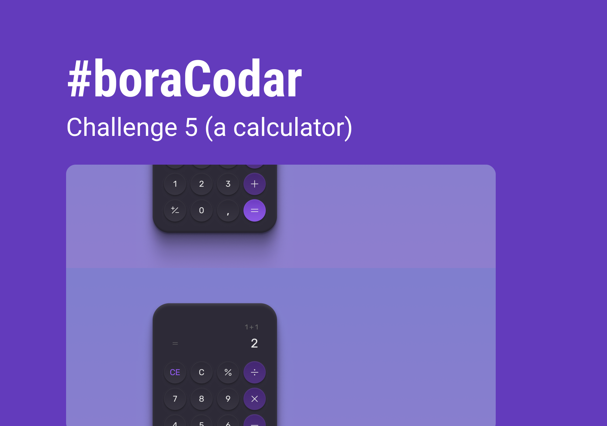

<h1 align="center"> CALCULATOR </h1>

A SIMPLE CALCULATOR

IN PRODUCTION

<a href="https://stellar-taffy-5ee198.netlify.app/">
  Click here or on the image above to access the project page
</a>

---

## HOW TO DEVELOP IT

- Clone this repositorty by using `git clone git@github.com:jairo-sousa/boracodar-5-calculator.git`
- Navigate into the main directory `cd <diname>`
- Run `npm run dev` to install node modules
- Run `npm start` to run it locally then will open on your browser on `localhost:5173`  
  \*port value may vary
- Run `npm run build` if you want to create a production build

## TECHNOLOGIES

Project developed with the following technologies:

- React Js
- Typescript
- Chackra UI
- Git and Github

## PROJECT

Weekly challenge [#boracodar](https://boracodar.dev/) proposed by [rocketseat](https://www.rocketseat.com.br/)

#5 - A SIMPLE CALCULATOR

A simple calculator developed with React

## LAYOUT

You can view the project layout through [THIS LINK](https://www.figma.com/community/file/1202607074523509182). You must have a [FIGMA](https://www.figma.com/) account to edit it.

---

Created by [Jairo Sousa](https://github.com/jairo-sousa)
